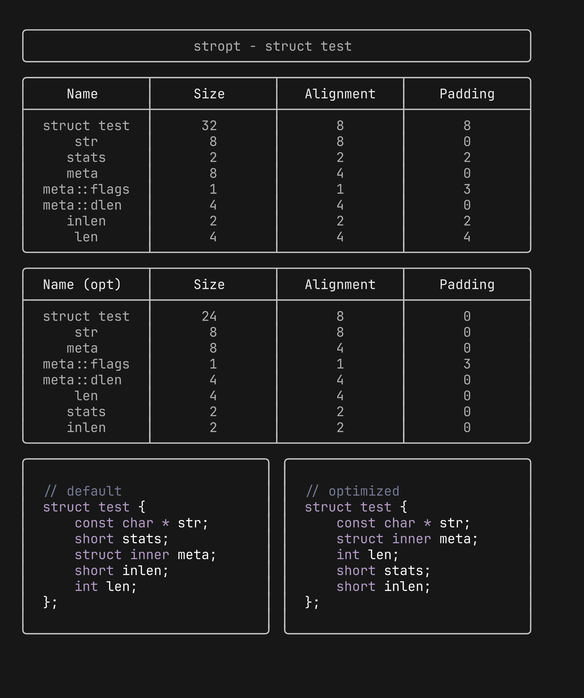

# stropt

`stropt` - *str*uct *opt*imizer- is a tool that can be used to obtain 
statistics about C aggregate types (struct, unions), like their size, 
alignment and total padding bytes.

This can prove useful to optimize the layout of a struct in your code.

`stropt` offers statistics on a C aggregate type (structs, unions), passed 
as a parameter, and contained in a source file to be provided to the tool.

More info on C structs and how compilers handle them 
[in this article here](https://dev.to/abathargh/optimizing-c-structs-layouts-4kkm).

## Build

```bash
git clone https://github.com/Abathargh/stropt
go build

// or, if you want to install this directly
go install github.com/Abathargh/stropt
```

## Usage

You can either use `stropt` by passing the source to analyze as a string:

```bash
stropt "struct meta" "struct meta { int a; double d; float f[100];};"
```

Or you can pass a file in which the definition is contained:

```c
// test.c
struct test {
  const char * str;
  unsigned char flag;
  const int * const iptr;
  char c;
};
```

```bash
stropt -file test.c "struct test" 
```

## Optimizing hints

You can use `-optimize` to get hints on how to optimize your struct layout, so 
that its size is minimized:



Note that specifying `-verbose` will print information about the layout of 
fields that are structs themselves.


## Specify platform-specific alignment and sizes

A series of flags can be used to specify the size of base types on your 
platform (e.g. char, short, int, long, etc.). These are the following:

- ptr
- enum
- char
- short
- int
- long
- longlong
- float
- double
- longdouble

Use them as such:

```bash
stropt -ptr 4,4 -file test.c "struct test"
```

## License

GPL 2.0

The output of this tool is not covered by this license, and any code produced 
by it has the same license of the one used to generate it. 
